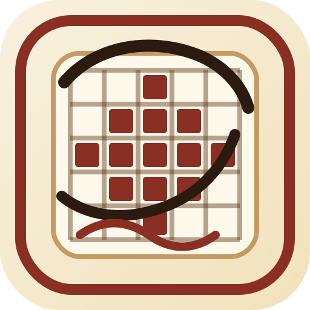

# Nonogram (数织)

<p align="center">
  
</p>

> This project is **100% generated with Vibe Coding**.  
> From product idea to React/TypeScript implementation, test scaffolding, and deployment setup, everything is produced through AI-driven coding workflow.

## Live Demo

- GitHub Pages: https://gh.zhuangty.com/nonogram/
- Repository: https://github.com/TennyZhuang/nonogram

## What It Includes

- Mobile-friendly Nonogram gameplay
- Multiple difficulty levels and game modes
- Canvas-based board rendering and input handling
- Persistence layer for progress and achievements
- PWA support (installable web app)
- Automated deployment to GitHub Pages via GitHub Actions

## Tech Stack

- React 19 + TypeScript
- Vite 7
- Zustand + Dexie
- Vitest + Playwright
- GitHub Actions + GitHub Pages

## Local Development

```bash
npm ci
npm run dev
```

## Build

```bash
npm run build
```

## Test

```bash
npm run test:run
npm run test:e2e
```

## Offline Puzzle Search Benchmark

Run puzzle search locally (no network required), with per-tier timing:

```bash
npm run bench:offline-search -- --count 3
```

## Deployment

Push to `main` branch and GitHub Actions will automatically deploy `dist/` to GitHub Pages.
